# Artier — 시스템 아키텍처 v1.0

> **v1.0 변경 요약 (2026-04-19)**:
> - 최초 작성. 사용자 앱 구현 역공학 기준 단일 스냅샷.
> - §5.2 알림 채널 참조를 Policy §1으로 정정. §10에 N-10(약관·개인정보처리방침 법무 확정본) 추가.
> - §11 SEO 및 robots 정책, §12 배포 정책(무중단 원칙·중단 공지 절차·환경 플래그), §13 다음 문서로의 연결 신설.

**작성일**: 2026-04-19
**버전**: v1.0
**근거**: 사용자 앱 구현 역공학(2026-04-19)
**상위 참조**: `README.md` (문서 규약·서비스 핵심 결정)
**본 문서의 목적**: 설계·개발 착수 시 참고할 전체 시스템 관계·데이터 모델·외부 연동을 한 장에 정리한 아키텍처 스냅샷. 이후 IA_ScreenList, Policy, PRD 문서는 이 구조를 근거로 작성된다.

---

## 0. 문서 읽는 법

이 문서는 다음 순서로 구성된다.

1. **서비스 전체 구조** — 사용자 트랙과 운영 트랙을 한 장으로 요약
2. **프론트엔드 아키텍처** — 클라이언트 측 구성
3. **데이터 모델 (ERD)** — 핵심 엔티티와 관계
4. **저장소 전략** — Phase 1 클라이언트 저장 + 런칭 전 백엔드 전환
5. **외부 시스템 연동** — 인증·알림·결제 (Phase 1 모의 / 런칭 전 백엔드 연동 시 실연동)
6. **운영 어드민 구조** — 권한 체계와 주요 액션
7. **핵심 플로우 시퀀스** — 가입·업로드·검수·초대 발송
8. **수익화·라이선스 모델** — Phase 단계별 원칙
9. **해소된 결정 사항** — 지금까지 확정된 굵직한 결정
10. **아직 열려 있는 항목** — Phase 1·2에서 결정이 남은 쟁점

다이어그램은 Mermaid로 작성되어 있으며 노션·깃허브·VS Code 프리뷰에서 그대로 렌더링된다. 엔지니어가 아닌 PM이 읽어도 이해할 수 있게 각 다이어그램 뒤에 글로 한 번 더 풀어 썼다.

---

## 1. 서비스 전체 구조

Artier는 **시니어·중장년 순수미술 작가를 위한 디지털 갤러리 플랫폼**이다. 작가가 자신의 전시를 올리고, 감상자가 작품을 둘러보고, 운영팀이 콘텐츠 품질과 커뮤니티 건강성을 관리한다.

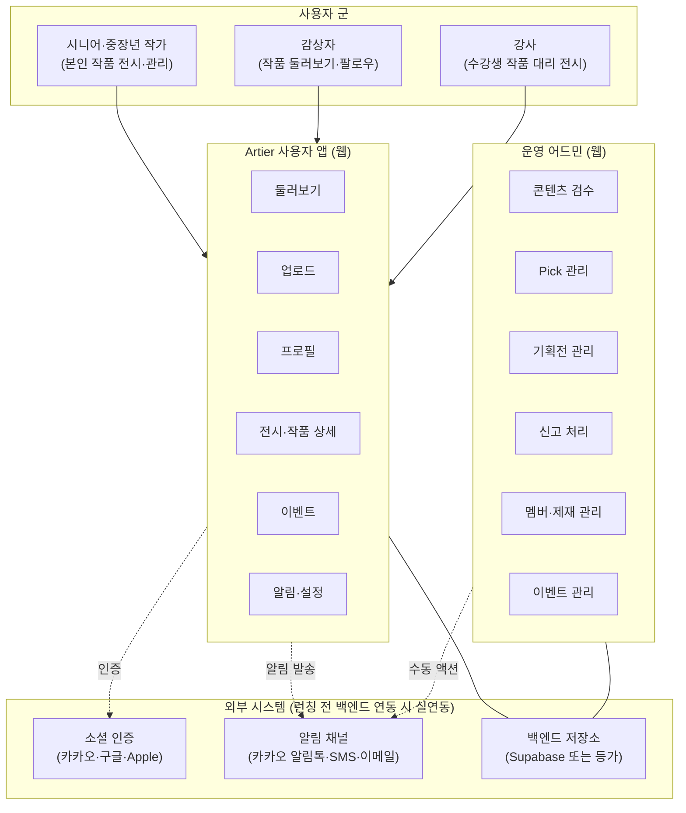

**요약**

- **하나의 사용자 앱 + 하나의 운영 어드민** 구조. 어드민은 사용자 앱과 다른 경로(`/admin/*`)로만 접근 가능하며 일반 사용자에게 노출되지 않는다.
- 사용자 군은 세 가지로 나뉘지만 동일한 사용자 앱을 쓴다. "강사"는 별도 계정 유형이 아니라 **업로드 이력에서 자동 파생**되는 역할이다(수강생 작품을 대리 업로드한 이력이 있으면 프로필에 `수강생 작품` 탭이 자동으로 노출됨).
- Phase 1에서는 외부 시스템이 모두 모의(mock) 상태다. 런칭 전 백엔드 연동 단계에서 실제 연동이 들어간다.

---

## 2. 프론트엔드 아키텍처

### 2.1 기술 스택

| 계층 | 선택 |
|------|------|
| 빌드 도구 | Vite |
| UI 프레임워크 | React 19 + TypeScript |
| 라우팅 | react-router v7 (선언적 라우트 트리) |
| 스타일 | Tailwind CSS + shadcn/ui · Radix UI |
| 상태 관리 | 경량 퍼블리시-서브스크라이브 스토어 (React의 `useSyncExternalStore` 기반). 외부 상태관리 라이브러리(Redux/Zustand 등)는 사용하지 않는다. |
| 국제화 | 자체 i18n 프로바이더. 현재 한국어(KO)·영어(EN) 2개 지원 |
| 이미지 처리 | 브라우저 내 `canvas`를 이용한 WebP 변환·리사이즈 |

### 2.2 렌더링 모델

- **SPA(Single-Page App)**. 서버 사이드 렌더링(SSR) 없음.
- 모든 라우트는 클라이언트 측에서 해석되며, 배포는 정적 호스팅(예: Netlify) 기준으로 한다.
- OG(Open Graph) 동적 이미지 생성은 Phase 1 범위 밖. 공유 링크의 OG는 정적 이미지로 대응한다.

### 2.3 반응형

- **모바일 우선**(375~414px 기준)으로 레이아웃을 설계하고, 데스크톱(1280px+)에서 너비 확장한다.
- 시니어 사용 맥락을 고려해 **모든 인터랙티브 요소의 최소 터치 타겟은 44×44px**.
- 가로 스크롤 영역(탭 목록 등)은 모바일에서 가능한 한 제거하고, 필요 시 그리드/줄바꿈으로 대체한다.

### 2.4 에러 경계·정지 가드

- 최상위에 **전역 에러 경계(Error Boundary)**를 두고 렌더 에러가 발생하면 폴백 UI로 대체한다.
- **계정 정지 전역 가드**: 사용자가 어떤 페이지에 있든, 정지 상태가 감지되면 즉시 강제 로그아웃하고 로그인 화면으로 유도한다.

---

## 3. 데이터 모델 (ERD)

Phase 1에서는 별도 백엔드 스키마가 없고 클라이언트가 동일한 구조로 로컬에 저장한다. 런칭 전 백엔드 이관 시 이 ERD가 출발점이 된다.

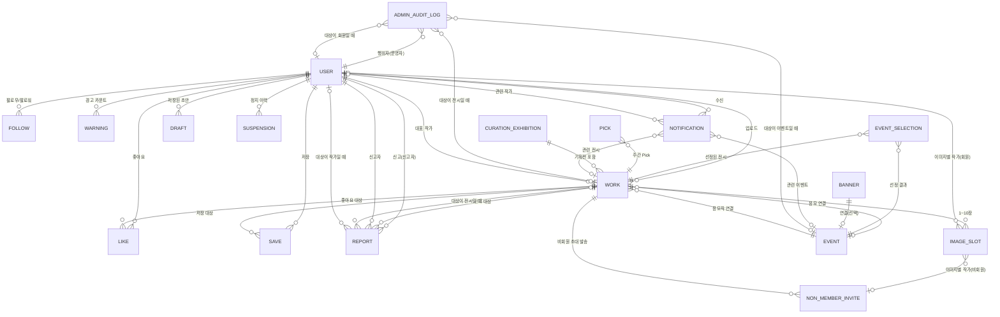

### 3.1 핵심 엔티티 설명

**USER (회원)**
사용자 계정. 이메일 가입 또는 소셜 가입(카카오·구글·Apple). 실명·전화번호·생년월일은 가입 시 필수 수집한다. 프로필 편집 가능 항목: 닉네임, 한 줄 프로필(헤드라인), 바이오(200자), 국가, 관심 화풍, 외부 링크, 프로필 사진.

**WORK (전시)**
중요한 명명 규칙: 내부 타입 이름은 "Work"지만 **사용자에게 노출되는 용어는 "전시"**다. 하나의 업로드 = 하나의 전시이며, 1~10장의 이미지를 포함하는 컨테이너로 작동한다.

- 전시 유형: 개인전(`solo`) / 그룹전(`group`)
- 그룹전의 경우 **참가자 역할**(본인 작품 최소 1점 포함) 또는 **강사 역할**(수강생 작품 대리 업로드, 본인 작품 포함 금지) 선택
- 검수 상태: 확인 중 / 게시 가능 / 수정 필요 — 기본값 "확인 중"
- 배지: Pick 배지(주간 선정 이력), 이벤트 선정작 배지(향후 추가)

**IMAGE_SLOT (전시 내 개별 이미지)**
별도 엔티티로 저장하지 않고 WORK 안의 배열 요소로 존재한다. 각 슬롯은 이미지 URL, 작품명, 이미지별 작가 지정 정보를 가진다.

- 이미지별 작가 지정은 **회원**(ID 연결) 또는 **비회원**(이름 + 전화번호)으로 선택
- 개별 작품명은 전시 단위로 저장되지만, 이미지 슬롯별로 각기 다르게 지정 가능
- 좋아요·저장·픽·신고·배지는 이 레벨에 **없다** (모두 WORK 단위)

**EVENT (이벤트)**
운영팀이 주관하는 공모전·특집전 등. Phase 1에서는 응모(`linkedEventId`로 전시가 연결됨)만 동작하고, **선정 시스템은 Phase 1 후순위 TODO**로 유보되어 있다.

**PICK·CURATION_EXHIBITION (운영팀 큐레이션)**
Pick은 주간 최대 10개 전시 선정(교체 가능), 기획전은 운영팀이 여러 전시를 주제로 엮어 내보내는 공개 컬렉션. 둘은 완전히 별개 시스템이며 자세한 정책은 Policy 문서 §5 참조.

**NON_MEMBER_INVITE (비회원 초대)**
업로드 시 이미지별 작가를 "비회원"으로 지정할 수 있다. 전시가 운영팀 검수 승인 시점에 해당 비회원에게 카카오 알림톡(한국)·이메일(해외)로 초대 메시지가 발송되고, 이후 가입 시 전화번호+실명 일치로 자동 매칭된다.

**REPORT (신고) / WARNING (경고)**
사용자는 부적절한 전시·작가를 신고할 수 있다. 운영팀 처리 액션에 따라 경고 카운트 또는 허위 신고 카운트가 누적되며, 각각 3회 누적 시 자동 7일 정지가 발동된다.

**NOTIFICATION (알림)**
좋아요·팔로우·검수 결과·신작 발행 등 이벤트성 알림. 수신자별로 누적되며 읽음/삭제 가능. 보관 정책은 90일 최대 200개.

**DRAFT (초안)**
업로드 화면에서 "초안 저장" 버튼으로 명시적으로 저장한 작업 중 데이터. 자동 저장은 없다. 사용자가 이어서 작업하거나 삭제 가능.

**SUSPENSION (정지)**
주의 / 7일 정지 / 30일 정지 / 영구 정지 4단계. 자동 승격(경고 3회·허위 신고 3회)과 운영팀 수동 조치 모두 지원.

**ADMIN_AUDIT_LOG (운영자 감사 로그)**
모든 어드민 액션을 append-only로 기록. 행위자·대상·사유·스냅샷·시각을 포함해 감사 추적성을 보장한다. Phase 1은 localStorage(`artier_admin_audit_log_v1`)에 누적하되 런칭 전 백엔드 이관 시 서버 테이블로 재출발하며 Phase 1 기록은 폐기한다. 보존 5년·append-only. 상세는 [PRD_Admin §0.6](PRD_Admin_v1.md#06-감사-로그-audit-trail).

### 3.2 엔티티 필드 상세

각 엔티티의 주요 필드를 모두 나열한다. 필드명은 논리명이며 실제 저장·API 계약 시 네이밍은 별도 가이드를 따른다.

#### EXHIBITION (Work)

| 필드 | 타입 | 설명 | 제약 |
|---|---|---|---|
| id | string | 전시 고유 ID | UUID |
| artistId | string | 업로더 작가 ID | 필수 |
| authorId | string? | 실제 업로드자 ID | 강사 대리 업로드 시 artistId와 다름 |
| exhibitionName | string | 전시명 | 필수, 최대 20자, 비속어 불가 |
| primaryExhibitionType | 'solo'\|'group' | 전시 유형 | 혼자/함께 구분 |
| groupName | string? | 그룹명 | 그룹 전시 필수, 최대 20자 |
| isInstructorUpload | boolean? | 강사 대리 업로드 | 강사 역할 시 true |
| image | string[] | 이미지 배열 | 1~10장, WebP 변환됨 |
| imagePieceTitles | string[] | 이미지별 작품명 | image와 동일 길이, 빈 값은 "무제" 표시 |
| imageArtists | ImageArtistAssignment[] | 이미지별 작가 지정 | 회원 또는 비회원 |
| customCoverUrl | string? | 커스텀 커버 이미지 | data URL, 이미지 배열에 미포함 |
| coverImageIndex | number? | 대표 이미지 인덱스 | 기본 0, -1은 customCover 사용 |
| description | string? | 전시 설명 | |
| tags | string[]? | 태그 목록 | 검색 가중치 |
| likes | number | 좋아요 수 | 기본 0 |
| saves | number | 저장 수 | 기본 0 |
| feedReviewStatus | 'pending'\|'approved'\|'rejected' | 검수 상태 | 기본 'pending' |
| rejectionReason | 'low_quality'\|'spam'\|'inappropriate'\|'copyright'? | **현재** 반려 사유 | rejected 시만 유의미. 재발행 시 초기화됨 |
| rejectionHistory | Array&lt;{reason, rejectedAt, note?}&gt;? | 반려 이력(누적) | 반려할 때마다 append. 재발행해도 **보존**. 감사·재범 추적용 |
| isHidden | boolean? | 운영자 비공개 | true → 피드·검색·타인 프로필에서 제외 |
| pick | boolean? | 현재 주간 Pick 활성 | 매주 교체 |
| pickBadge | boolean? | Pick 선정 이력 배지 | 한 번 받으면 영구 |
| linkedEventId | string\|number? | 연결 이벤트 ID | 중복 참여 검증에 사용 |
| uploadedAt | string | 업로드 시각 | 로컬 ISO 기준 |
| coOwners | Artist[]? | 공동 제작자(레거시) | 후순위 재검토 |

**ImageArtistAssignment**:
- `type: 'member'` → { memberId, memberName, memberAvatar }
- `type: 'non-member'` → { displayName, phoneNumber }

#### USER_PROFILE

| 필드 | 타입 | 설명 | 제약 |
|---|---|---|---|
| id | string | 사용자 ID | PK |
| name | string | 표시 이름 | 최대 20자, 비속어 불가 |
| nickname | string? | 닉네임 | 2~20자, 비속어 불가 |
| realName | string | 실명 | 2~20자, 본인인증 결과 또는 온보딩 수집 |
| phone | string | 전화번호 | 숫자 7자리 이상, 중복 불가 |
| email | string? | 이메일 | 형식 검증, 중복 불가(소셜 첫 가입·해외 시 필수) |
| birthDate | string | 생년월일 | 만 14세 이상 |
| headline | string? | 한 줄 소개 | 최대 20자 |
| bio | string? | 상세 소개 | 최대 200자 |
| location | string? | 지역 | 드롭다운 선택(국가/기타) |
| interests | string[]? | 관심사 | 최대 15종 토글 |
| avatarUrl | string? | 프로필 사진 | 5MB 이하 |
| externalLinks | { label, url }[]? | 외부 링크 | 6 플랫폼 지원 |
| authProvider | 'email'\|'kakao'\|'google'\|'apple' | 가입 경로 | |
| createdAt | string | 가입 시각 | ISO |
| instructorVisible | boolean (파생) | 강사 표시 여부 | 업로드 이력에서 자동 파생 |

#### DRAFT

| 필드 | 타입 | 설명 |
|---|---|---|
| id | string | 초안 ID |
| title | string | 표시용 제목 |
| uploadType | 'solo'\|'group'? | |
| isInstructor | boolean? | |
| groupName | string? | |
| exhibitionName | string? | |
| coverImageIndex | number? | |
| customCoverUrl | string? | |
| contents | 초안 이미지·작가 스냅샷[] | 전시 구성 저장 |
| savedAt | string | 저장 시각 |

#### INTERACTION

| 필드 | 타입 | 설명 |
|---|---|---|
| liked | string[] | 좋아요한 전시 ID |
| saved | string[] | 저장한 전시 ID |

#### FOLLOW

| 필드 | 타입 | 설명 |
|---|---|---|
| followingIds | string[] | 현재 사용자가 팔로우하는 작가 ID |

#### NOTIFICATION

| 필드 | 타입 | 설명 |
|---|---|---|
| id | string | 알림 ID |
| type | 'like'\|'follow'\|'pick'\|'system'\|'event' | 5종(검수 승인·반려·초대 수락은 system 계열) |
| message | string | i18n 템플릿 렌더 결과 |
| fromUser | { id, name, avatar }? | like·follow 시 |
| workId | string? | 관련 전시 |
| read | boolean | 읽음 상태 |
| createdAt | string | 생성 시각 |

보관 200건 · 90일 자동 정리.

#### NOTIFICATION_SETTING

| 필드 | 기본 | 설명 |
|---|---|---|
| like | true | 좋아요 알림 |
| newFollower | true | 팔로워 알림 |
| groupExhibitionInvite | true | 그룹 초대 알림 |
| followingNewWork | false | 팔로우 작가 신작 |
| weeklyTheme | false | 주간 기획전 |
| marketing | false | 마케팅 |

#### EVENT (ManagedEvent)

| 필드 | 타입 | 설명 |
|---|---|---|
| id | string\|number | 이벤트 ID |
| title | string | 제목 |
| subtitle | string? | 부제 |
| description | string | 설명 |
| bannerImageUrl | string | 배너 이미지 |
| linkUrl | string? | 외부 링크 |
| startAt | string | 시작일(YYYY-MM-DD, 로컬) |
| endAt | string | 종료일 |
| status | 'scheduled'\|'active'\|'ended'? | 자동 계산 또는 수동 오버라이드 |
| worksPublic | boolean | true = 즉시 참여작 공개 |
| participantsLabel | string? | 참여 안내 |

#### BANNER (AdminBanner)

| 필드 | 타입 | 설명 |
|---|---|---|
| id | string | 배너 ID |
| title | string | |
| subtitle | string? | |
| imageUrl | string | |
| linkUrl | string? | |
| startAt | string? | |
| endAt | string? | |
| isActive | boolean | 기간 내 + 활성 = 노출 |

상한 5개 · DnD 순서 · 로컬 자정 기준 만료 자동 판정.

#### CURATION

| 필드 | 타입 | 설명 |
|---|---|---|
| theme | { title, subtitle?, workIds: string[] }? | 현재 기획전 |
| featuredArtistIds | string[] | 추천 작가 |

#### PICK

현재 Pick과 영구 이력은 분리:
- 현재: EXHIBITION.pick = true
- 이력: EXHIBITION.pickBadge = true(한 번 선정되면 영구)
- 이력 목록: 별도 저장소에 워크 ID 배열

#### SANCTION

| 필드 | 타입 | 설명 |
|---|---|---|
| targetArtistId | string | 대상 |
| warningCount | number | 경고 누적 |
| falseReportCount | number | 허위 신고 누적(신고자용) |
| suspensionLevel | 'warning'\|'days7'\|'days30'\|'permanent'? | 정지 단계 |
| suspendedUntil | string? | 해제일(영구면 null) |
| reason | string? | 정지 사유 |

자동 승격: warningCount == 3 → days7, falseReportCount == 3 → days7 차단.

#### REPORT

| 필드 | 타입 | 설명 |
|---|---|---|
| id | string | 신고 ID |
| targetType | 'work'\|'artist' | 대상 유형 |
| targetId | string | 대상 ID |
| targetName | string | UI 표시용 |
| targetArtistId | string? | 경고 카운트 누적용 |
| reporterId | string | 신고자 |
| reasonKey | 'copyright'\|'inappropriate'\|'spam'\|'misleading'\|'other' | 신고 사유 5종 |
| detail | string | 상세(최대 200자) |
| createdAt | string | 접수 시각 |
| adminStatus | 'pending'\|'deleted'\|'warned'\|'dismissed'\|'hidden' | 처리 결과 |

> **주의**: **사용자 신고 사유(Report.reasonKey)는 5종** (저작권·부적절·스팸·오도·기타), **검수 반려 사유(Exhibition.rejectionReason)는 4종** (저품질·스팸·부적절·저작권)로 별도 집합임.

#### INVITE (비회원 초대)

발송 로그(최대 300): id, workId, 전화 마스킹, 표시명, 채널, locale, 메시지, 성공 여부, 실패 사유, at
매칭 로그(최대 200): inviteId, workId, 전화, 초대 이름, 가입 실명, status(`matched`\|`blocked_name_mismatch`), at

#### POINT_LEDGER

엔트리: id, at, kind(이벤트 종류), ap(음수=회수), note
상태: 누적 AP · 각 마일스톤 달성 여부 · 일일 업로드 수 · 월별 카운터
원장 상한 500건 순환.

#### 기타 엔티티 (요약)

- **EVENT_SUBSCRIPTION** — 이메일·이벤트 ID·구독 시각
- **NOTICE** — 제목·본문·카테고리·게시일·고정 여부
- **INQUIRY** — 이름·이메일·카테고리(6종)·내용·첨부
- **SEARCH_HISTORY** — 기록 배열(최대 10), 계정별/게스트 분리
- **UI_PREFERENCES** — locale, fontScale, cookieConsent, onboardingDone, splashSeen
- **AUTH_SESSION** — 토큰·만료(Phase 1 모의)
- **PARTNER_ARTIST** — 이름·연락처·단계(5)·제출 상태(5)·메모·이력
- **LAUNCH_CHECK_ITEM** — 제목·카테고리·상태(4)·기한·담당자
- **UNRESOLVED_ISSUE** — 제목·설명·상태(4)·우선순위(4)·담당자·차단 여부
- **ACCOUNT_SUSPENSION** — 현재 정지 상태 글로벌 레코드
- **WITHDRAWN_ARTIST_LIST** — 탈퇴 작가 ID 집합(익명화 판정)

#### ADMIN_AUDIT_LOG

| 필드 | 타입 | 설명 |
|---|---|---|
| id | string | 로그 ID (ULID) |
| actorId | string | 행위자 운영자 ID |
| actorRole | enum | `operator`(Phase 1) · `super`/`editor`/`viewer`(Phase 2) |
| action | string | 액션 코드(`review.approve`·`report.delete`·`member.suspend.perm` 등) |
| targetType | enum | `work`·`artist`·`event`·`banner`·`pick`·`theme`·`notice`·`inquiry` |
| targetId | string | 대상 ID |
| targetSnapshot | object? | 복구 불가 액션 전 대상 핵심 필드 스냅샷 |
| reason | string? | 사유 메모(반려 사유·신고 처리 메모) |
| metadata | object? | 액션별 부가(정지 기간·반려 사유 분류 등) |
| ip | string? | 운영자 IP(백엔드 이관 후 기록) |
| userAgent | string? | 운영자 UA |
| createdAt | string | ISO 8601 |

보존 5년·append-only·조회 권한 Phase 2 최고 운영자 전용. [PRD_Admin §0.6](PRD_Admin_v1.md#06-감사-로그-audit-trail) 참조.

### 3.3 상태 전이 다이어그램

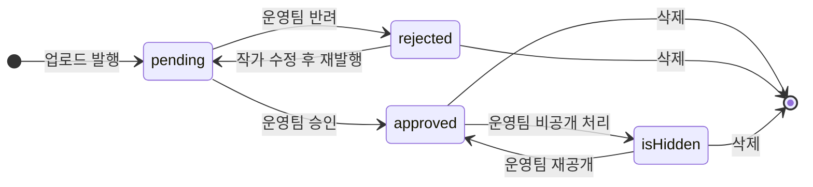

**전시 상태**: `pending`은 본인 프로필에서만 보이고, `approved`만 피드·검색·큐레이션 노출. `rejected`는 본인 프로필에서만 보이고 반려 사유 모달로 재진입. `isHidden`은 본인 프로필만 예외 노출.

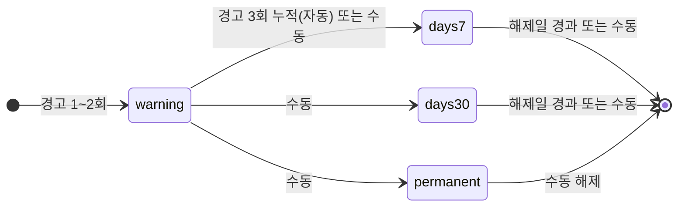

**정지 단계**: `warning`은 차단 없음. `days7/30/permanent`는 다음 로그인 시 차단.

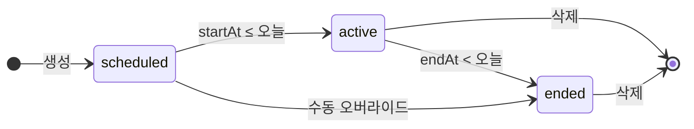

**이벤트 상태**: 로컬 자정 기준 자동 계산, 운영자가 수동 오버라이드 가능.

---

## 4. 저장소 전략

### 4.1 Phase 1 — 클라이언트 로컬 저장

Phase 1은 별도 백엔드 없이 브라우저에서만 동작한다.

| 계층 | 용도 |
|------|------|
| **localStorage** | 기본 앱 상태(작품 목록·프로필·인터랙션·알림·배너·이벤트·큐레이션·신고·제재 카운터·가입 레지스트리 등) |
| **IndexedDB** | 용량이 큰 이미지 데이터 URL이 localStorage 쿼터를 초과할 경우 자동 오프로드. 작품 삭제 시 연쇄 삭제. |
| **sessionStorage** | 스크롤 위치 복원, 세션 한정 임시 플래그(예: 이름 불일치로 보류된 초대 목록) |

### 4.2 버전 관리

- 작품 저장소에 **스토리지 버전 키**가 있고, 버전이 달라지면 시드 데이터만 재시드하고 사용자 업로드는 보존한다. 필드명 변경 등 스키마 마이그레이션도 이 시점에 수행한다.
- 예: 기존 필드 이름 `editorsPick` → `pickBadge`로 바꿀 때, 사용자 저장분의 기존 값을 새 필드로 옮기는 마이그레이션이 동반됨.

### 4.3 전시 삭제 시 연쇄 정리 (참조 무결성)

전시 1건이 삭제되면(사용자 자가 삭제 · 어드민 삭제 · 신고 처리 "삭제" 모두) 해당 ID를 참조하는 **모든 저장소의 레코드를 즉시 정리**해 stale 참조가 남지 않도록 한다. Phase 1은 클라이언트 단일 소스라 즉시 원자적 정리 가능. 런칭 전 백엔드 이관 시 트랜잭션·cascade FK 또는 배치 정리로 대체한다.

| 대상 | 정리 내용 | 트리거 |
|---|---|---|
| 전시 목록 | 해당 ID 레코드 제거 + 이미지 IndexedDB 미디어 삭제 | removeWork |
| 포인트 | 업로드 시각 레코드 제거, 24h 이내 삭제면 AP -20 회수 | removeWork 시작 시점 |
| 인터랙션 | 모든 사용자의 liked / saved 배열에서 ID 제거 + 작가 팔로워 델타는 유지 | removeWork |
| 알림 | workId 참조 레코드 전부 제거 | removeWork |
| 신고 큐 | targetId 매칭 레코드 제거 | removeWork |
| 신고 중복 서명 | `<reporter>|work|<id>` 서명 제거(재신고 가능해짐) | removeWork |
| 신고자 숨김 | 모든 신고자의 숨김 workIds 배열에서 제거 | removeWork |
| Pick | 현재 Pick 배열·이력 배지에서 해당 ID 제거 | removeWork |
| 기획전 | theme.workIds 배열에서 제거 | removeWork |
| "이미 본" 기록 | feed_seen_work_ids 배열에서 제거 | removeWork |
| 이벤트 연결 | 전시의 `linkedEventId`는 **이벤트 삭제 시** 전시 측에서 정리(반대 방향) | removeEvent |

구현 시 각 저장소는 자체 `cleanupRefsForWork(workId)` 함수를 가지며, `removeWork`는 오케스트레이터로 이를 순차 호출한다.

### 4.4 런칭 전 백엔드 전환 계획

- **대상**: Supabase(또는 등가의 관리형 Postgres + Auth + Storage) 기준으로 설계
- **이관 방식**: 위 ERD를 Postgres 스키마로 정제 → 클라이언트 저장 구조를 어댑터 레이어로 감싸서 API 호출로 전환
- **이미지 저장**: 브라우저의 IndexedDB 이미지는 서버 Storage로 이관(마이그레이션 스크립트)
- **배포 영향**: 사용자 경험은 동일하게 유지. URL 체계·화면은 변경 없음을 원칙으로 한다.

---

## 5. 외부 시스템 연동

### 5.1 인증

| 항목 | Phase 1 | 런칭 전 백엔드 연동 후 |
|------|---------|--------|
| 이메일 로그인·가입 | 모의 (로컬 검증) | 실제 JWT 기반 |
| 카카오 소셜 | 모의 (UI만) | Kakao OAuth 실연동 |
| 구글 소셜 | 모의 | Google OAuth 실연동 |
| Apple 소셜 | 모의 | Sign in with Apple |
| 본인 인증 (실명·전화번호) | 가입 폼에서 자체 수집 | 본인 인증 API(PASS 등) 연동 검토 |

### 5.2 알림 채널 라우팅

사용자의 **전화번호 국가 코드를 기준으로 알림 채널이 라우팅**된다. 자세한 정책은 Policy §1 참조.

| 사용자 | 일반 알림 (좋아요·팔로우·초대·검수) | 비밀번호 재설정 | 법적 고지 (약관 변경·개인정보) |
|--------|------------------|------------------|------------------|
| 한국 사용자 | 카카오 알림톡 → SMS 폴백 | 카카오 알림톡 → SMS 폴백 | 이메일 (법적 기록 보존용) |
| 해외 사용자 | 이메일 | 이메일 | 이메일 |

Phase 1에서는 모든 발송이 모의(로그 저장만)이며, 런칭 전 백엔드 연동 단계에서 실제 발송 서비스(카카오 알림톡 API + SMS 게이트웨이 + 트랜잭션 메일)와 연동한다.

### 5.3 분석(Analytics)

Phase 1은 이벤트 호출 지점만 스캐폴딩되어 있고(GA4 `gtag()` 형태), 실제 송신은 연결되지 않았다. 런칭 전 운영팀이 데이터 기준을 확정한 뒤 실제 송신을 켠다.

### 5.4 결제 (Phase 2 이후)

Phase 1은 무료 서비스. Phase 2 이후 유료 기능 도입 시 결제 PG 연동을 별도로 논의한다.

---

## 6. 운영 어드민 구조

### 6.1 접근 제어

- URL 경로 `/admin/*`로 진입
- 접근 조건: 로그인 + **운영자 권한 플래그** (Phase 1은 로컬 세션 토글, 런칭 전 백엔드 연동 후 서버사이드 권한으로 승격 필수)

### 6.2 권한 계층 (Phase 2 설계)

Phase 1은 단일 운영자 레벨로 단순 운영된다. Phase 2 확장 시 아래 3단계를 권장한다.

| 권한 | 가능 액션 |
|------|---------|
| 최고 운영자 | 전 기능(멤버 정지·삭제·권한 부여 포함) |
| 에디터 | 콘텐츠 관리(검수·Pick·기획전·배너·이벤트·신고 처리). 멤버 삭제·권한 부여 불가 |
| 뷰어 | 모든 데이터 조회만 가능. 수정·삭제 불가 |

### 6.3 어드민 화면 전체 (IA_ScreenList 참조)

- 대시보드 (ADM-DSH)
- 콘텐츠 검수 (ADM-REV)
- Pick 관리 (ADM-PCK)
- 기획전 관리 (ADM-CUR)
- 배너 관리 (ADM-BNR)
- 이벤트 관리 (ADM-EVT)
- 신고 처리 (ADM-RPT)
- 멤버 관리 (ADM-MBR)
- 작품 관리 (ADM-WRK)
- 파트너 작가 (ADM-PTN)
- 런칭 체크리스트 (ADM-CKL)
- 미결 이슈 (ADM-ISU)

---

## 7. 핵심 플로우 시퀀스

### 7.1 신규 가입 (소셜 또는 이메일)

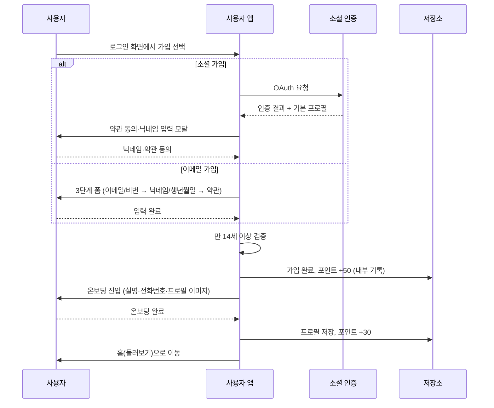

**요약**: 소셜과 이메일 진입로가 다르지만 이후 온보딩(실명·전화번호·프로필 이미지)은 공통. 만 14세 미만은 가입 차단.

### 7.2 전시 업로드 (개인전 / 그룹전 — 참가자 또는 강사)

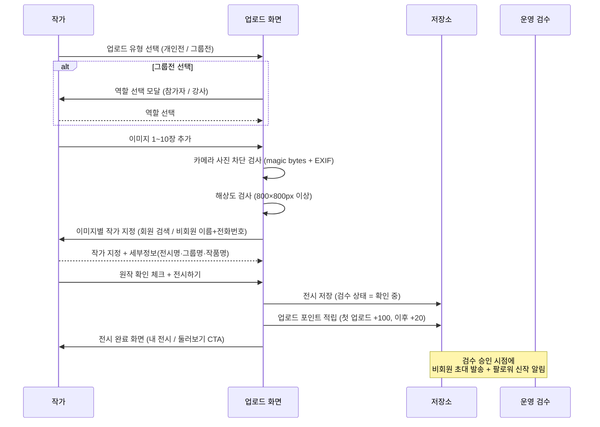

**요약**: 업로드는 역할 결정 → 이미지 → 작가 지정 → 세부정보 → 발행의 5단계. 카메라 촬영 사진은 파일 내용 기반으로 차단된다(확장자 변경으로 우회 불가). 비회원 초대는 업로드 시점이 아니라 **검수 승인 시점**에 발송된다.

### 7.3 콘텐츠 검수

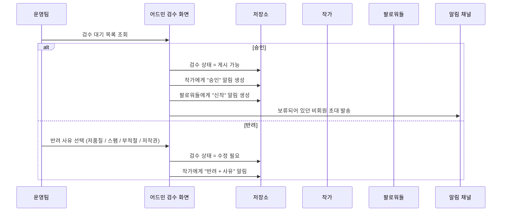

**요약**: 운영팀의 승인·반려 액션이 알림·비회원 초대 발송의 트리거가 된다. 반려 사유는 4종 중 1개를 필수로 선택해야 한다.

### 7.4 비회원 초대 → 자동 매칭

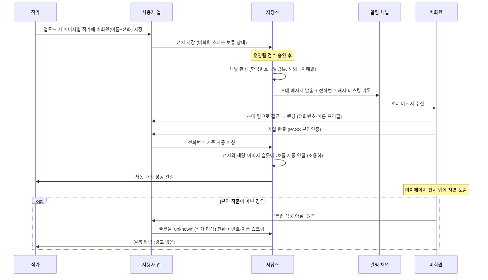

**요약**: 비회원 초대는 검수 승인 시점에만 발송되고, 가입 시 PASS 본인인증 기반으로 전화번호가 일치하는 모든 슬롯이 조용히 자동 연결된다. 본인 작품이 아닌 경우 마이페이지에서 사후 원복 가능하며, 슬롯은 작가 미상으로 전환되고 발신자에게 알림만 간다(경고 없음).

### 7.5 둘러보기 피드 인터랙션 (좋아요·저장·팔로우·신고)

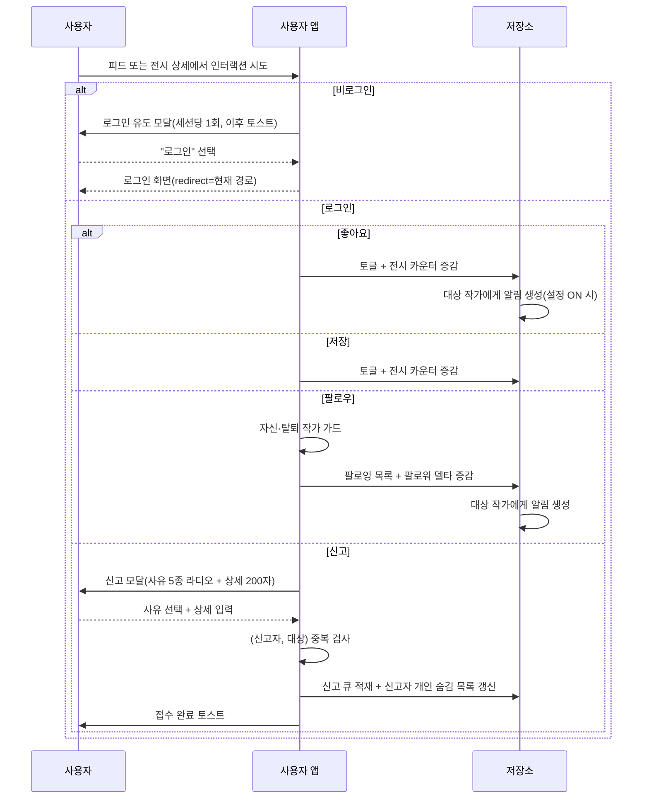

**요약**: 모든 보호 액션(좋아요·저장·팔로우·신고)은 비로그인 시 로그인 유도 → 세션당 1회 모달. 신고 사유는 저작권·부적절·스팸·오도·기타 5종이며 중복 신고는 한 번만 접수된다.

### 7.6 신고 → 운영팀 처리 → 자동 승격

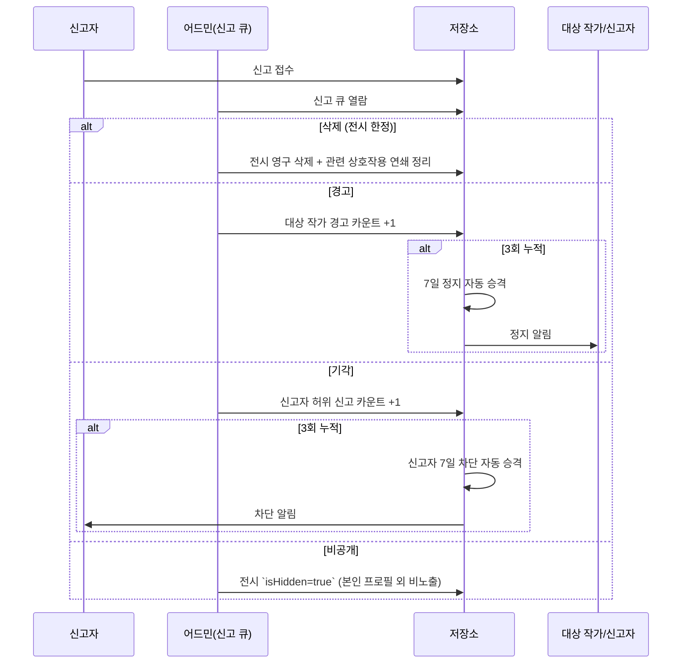

**요약**: 운영팀의 4액션(삭제·경고·기각·비공개) 각각에 따라 전시 상태·작가 카운트·신고자 카운트가 변한다. 경고·허위신고 모두 3회 누적 시 자동 7일 제재.

### 7.7 계정 정지 → 로그인 차단 → 이의제기

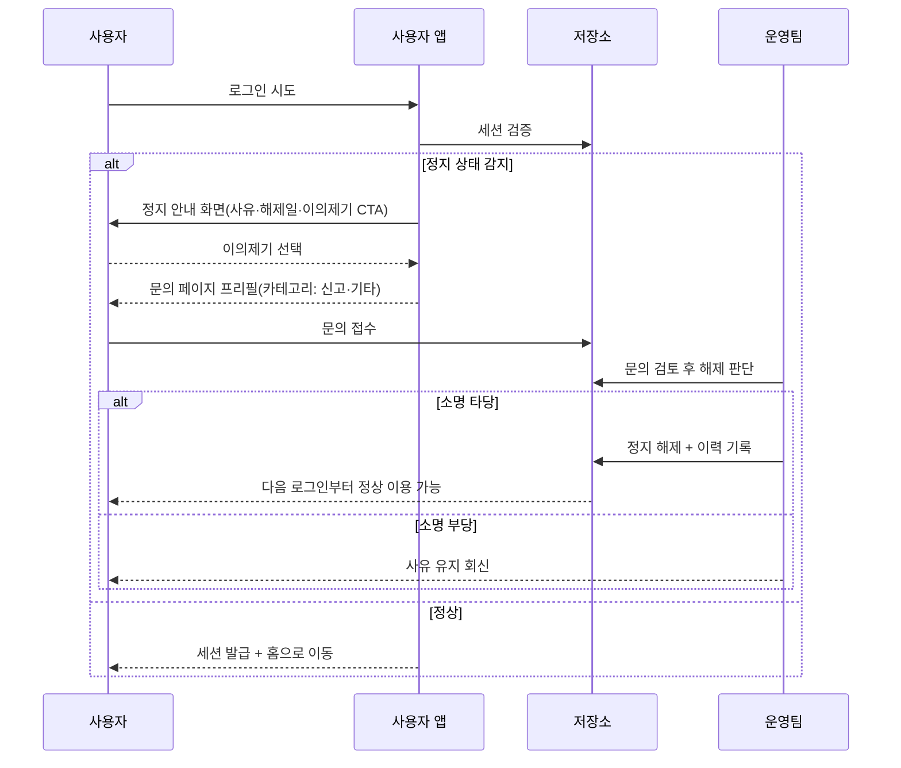

**요약**: 정지 단계 중 "주의"는 차단 없이 경고만. "7일/30일/영구"는 다음 로그인 시 차단 + 이의제기 링크 노출. 해제는 운영팀 수동 또는 시한 만료 시 자동.

### 7.8 탈퇴 → 작품 유지·익명화

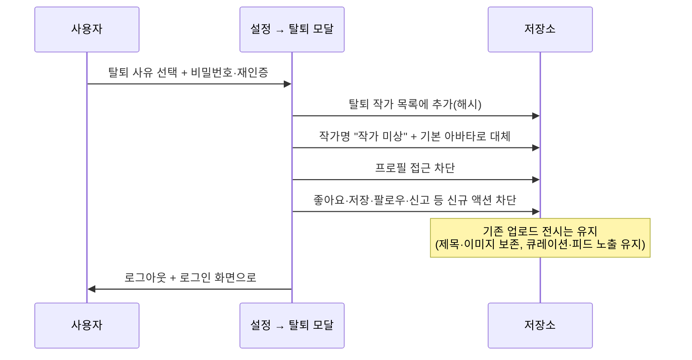

**요약**: 탈퇴는 사용자 식별 정보만 익명화하고 작품은 유지. 탈퇴 작가의 작품에 대한 새로운 상호작용은 모두 차단되며, 기존 상호작용은 유지된다.

### 7.9 큐레이션(Pick) 선정 → 피드 부스트 → 영구 이력 배지

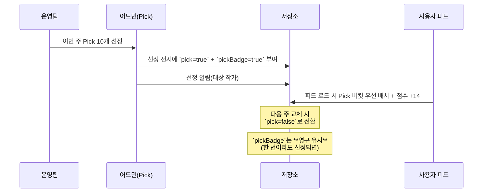

**요약**: Pick은 주간 10건 상한 · 교체되어도 이력 배지는 영구. 피드 점수에 +14 부스트 + 버킷 최상단 배치로 노출 우위를 가진다.

### 7.10 이벤트 참여 → 중복 차단

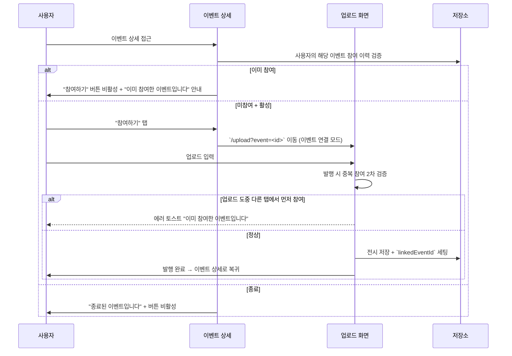

**요약**: 이벤트 연결 업로드는 진입·발행 두 시점에서 중복 참여 검증. 종료 이벤트는 버튼 자체 비활성.

---

## 8. 수익화·라이선스 모델

- **Phase 1**: 전면 무료. 사용자 가입·전시 업로드·감상·이벤트 참여에 어떤 결제도 요구하지 않는다.
- **Phase 2 이후**: 수익 모델 별도 논의. 유료 구독·프리미엄 전시·마켓 기능 등은 현 시점 미정.
- 포인트(AP) 시스템은 Phase 1에서는 내부 적립만 동작하고 사용자에게 노출되지 않는다. Phase 2 이후 연동 방향 별도 결정.

---

## 9. 해소된 결정 사항

설계·기획 과정에서 확정된 굵직한 결정을 모은다. 변경이 필요하면 버전을 올려 해당 섹션을 수정한다.

### 9-1. 좋아요·저장·픽·신고·배지는 모두 "전시(WORK 컨테이너) 단위"
개별 이미지 단위 인터랙션은 없다. 이미지 단위로 존재하는 것은 작품명·이미지별 작가 지정뿐.

### 9-2. 강사 여부는 자동 파생
업로드 이력에 강사 역할 전시가 한 건이라도 있으면 프로필에 "수강생 작품" 탭이 자동 노출된다. 프로필에 수동 토글은 없다.

### 9-3. 비회원 초대는 검수 승인 시점에 발송
업로드 순간에는 전화번호만 전시에 보관하고, 운영팀 승인 이후 실제 발송된다. 반려 시 보류 초대는 폐기.

### 9-4. 카메라 촬영 사진은 업로드 차단
파일 내용(magic bytes로 JPEG 판별 후 EXIF Make/Model 확인)으로 판별하므로 확장자 변경으로 우회할 수 없다.

### 9-5. 탈퇴 작가 처리
작품·전시는 유지되고 작가명이 "작가 미상"으로 익명화된다. 해당 작가에 대한 좋아요·저장·팔로우·신고 인터랙션은 모두 차단된다. 프로필 페이지 자체 접근도 불가.

### 9-6. 자동 저장 없음, 수동 초안 저장만
업로드 화면에서 작업 중 자동 저장은 제공하지 않는다. 사용자가 "초안 저장" 버튼을 눌러야 저장된다.

### 9-7. Pick과 기획전은 서로 다른 시스템
Pick은 주간 10개 개별 전시 선정(영구 배지), 기획전은 운영팀이 여러 전시를 주제로 엮는 공개 컬렉션(배지 없음). 배너에 별도 라벨(NEW/HOT/EVENT 등)은 두지 않는다.

### 9-8. 이벤트 선정작 배지 원칙
이벤트·주간 공모 테마전의 선정작에는 영구 배지를 부여한다. 응모작(`linkedEventId` 연결된 상태)에는 배지 없음. 구현은 Phase 1 후순위 TODO.

### 9-9. 본인이 전시를 비공개로 전환하는 기능은 없음
전시 비공개(`isHidden`)는 어드민이 신고 처리 또는 부적절 콘텐츠 관리 용도로만 조작한다.

### 9-10. 자동 정지 승격은 전체 사용자 대상
신고 경고 3회 누적 시 대상 작가 7일 정지, 허위 신고 3회 누적 시 신고자 7일 차단. 시범 계정이 아닌 전체 사용자에게 동일하게 발동된다.

### 9-11. 로컬 날짜 기준
배너 노출 기간·이벤트 상태 판정·작품 업로드일 기록은 모두 사용자 로컬 시간대의 YYYY-MM-DD를 기준으로 한다(UTC 기준 비교는 한국 사용자에게 9시간 밀림 문제 발생).

---

## 10. 아직 열려 있는 항목

런칭 전 또는 Phase 2에서 결정이 필요한 쟁점.

### N-1. 이벤트 선정 시스템 구현 (Phase 1 후순위)
원칙은 §9-8에서 확정. 어드민 이벤트 상세에 "선정 작품 관리" 섹션 추가, 주간 공모 테마전도 이벤트의 한 종류로 통합, 선정 시점에 영구 배지 부여 로직 등 상세 구현이 남아 있다.

### N-2. 운영자 내부 컬렉션 (Phase 2)
운영팀이 "좋은 전시·작가·그룹"을 내부 북마크하는 비공개 툴. 발굴·추적 목적. 현 Phase 1에선 수동 관리(엑셀·노션 등 외부 도구)로 대체.

### N-3. 작품 카테고리 분류 (Phase 2)
`art / fashion / craft / product` 등 카테고리 축으로 작품을 분류하는 기능. Phase 1엔 UI·정책 없음. Phase 2에 도입 시 업로드 플로우·검색·필터에 반영 필요.

### N-4. 소셜 가입 시 만 14세 연령 검증
이메일 가입은 생년월일 입력·검증이 있으나 소셜 가입은 OAuth 결과만 신뢰하는 구조라 연령 검증이 빈틈. 본인 인증 API 연동 또는 소셜 가입 후 생년월일 추가 수집이 필요.

### N-5. 이벤트 알림 구독 해지 수단
Phase 1 현재는 이메일 구독 추가만 가능하고 해지 UI가 없다. 개인정보보호법·GDPR 관점에서 **런칭 전 반드시 해결 필요**.

### N-6. 스토리지 마이그레이션 전략
스토리지 버전 변경 시 시드 재시드는 구현되어 있으나, 사용자 데이터를 어떤 기준으로 변환할지 체계가 아직 단순. 런칭 전 백엔드 이관 시 일회성 마이그레이션 스크립트가 필요하다.

### N-7. 어드민 권한 계층 분리
Phase 1은 단일 운영자 레벨. Phase 2에서 §6.2의 3단계(최고 운영자 / 에디터 / 뷰어)로 확장할 때 기존 운영 데이터의 권한 매핑·감사 로그 체계를 함께 설계해야 한다.

### N-8. 커뮤니티 기능 확장 (Phase 2 이후)
팔로우 기반 약한 연결이 이미 있고, 향후 댓글·메시지·그룹 기능 확장이 예상된다. 용어 체계(팔로우 유지 결정)는 이 확장성을 고려한 선택이며, 구체 범위는 Phase 2 기획에서 다룬다.

### N-9. OG 이미지 동적 생성
공유 링크가 외부(SNS·메신저)에서 미리보기로 노출될 때 작품 썸네일과 전시명을 담은 OG 이미지가 필요. SPA 구조 제약으로 서버 측 렌더링이 필요하며 Phase 1에는 정적 대체 이미지로 대응.

### N-10. 약관·개인정보처리방침 법무 확정본 (런칭 전 필수)
이용약관·개인정보처리방침 현재 초안 상태. 런칭 전 법무 검토 후 확정 필요. 개인정보보호법 대응을 위해 데이터 내보내기·삭제 요청 기능도 함께 구비해야 한다. DPO(개인정보보호 책임자) 지정·공개도 법적 요건. 상세는 Policy §21(법무 체크포인트) 참조.

---

## 11. SEO 및 robots 정책

공유·검색 유입을 고려한 페이지별 색인 정책. 각 화면 카드의 "SEO" 필드에서도 반복 명시.

| 화면/경로 | 색인 정책 | 비고 |
|---|---|---|
| 홈 피드 (`/`) | ✅ index | Open Graph: 서비스 카피. 타겟 키워드: "시니어 작가 갤러리", "디지털 전시" |
| 전시 상세 (`/exhibitions/:id`) | ✅ index | 각 전시의 작품·작가·설명 기반. 공개(`approved` + `!isHidden`) 전시만 |
| 초대장 랜딩 (`?from=invite`) | ❌ noindex | 초대 받은 사람 대상이므로 검색 색인 대상 아님 |
| 작품 공유 랜딩 (`?from=work`) | ✅ index | 단일 작품 미리보기 — OG 이미지 우선 |
| 큐레이션 전시 상세 | ✅ index | 운영팀 기획 큐레이션은 대표 유입 지점 |
| 이벤트 목록 (`/events`) | ✅ index | 공모·특집전 검색 노출 목적 |
| 이벤트 상세 (`/events/:id`) | ✅ index | structured data(JSON-LD) 적용 권장 |
| 작가 프로필 (`/profile/:id`) | ✅ index | 공개 작가의 작품·소개가 검색 대상. 본인/탈퇴 작가는 제외 |
| 둘러보기 탭·필터 파라미터 | ❌ noindex | 중복 콘텐츠 회피 |
| 인증·온보딩 (`/login`·`/signup`·`/onboarding`) | ❌ noindex | 개인화·흐름 페이지 |
| 설정·알림·초안·탈퇴 플로우 | ❌ noindex | 개인정보 보호 |
| 공지·FAQ·소개·이용약관·개인정보처리방침 | ✅ index | 신뢰 정보 노출 |
| 문의(`/contact`) | 📝 조건부 | 기본 noindex, 운영 판단 시 index |
| 어드민(`/admin/*`) | ❌ noindex | 내부 도구 |
| 데모·QA 툴 (`/demo/*`) | ❌ noindex | 배포 전 제거 |

### 11.1 Open Graph 메타

- 전시·이벤트·프로필의 OG 이미지·제목·설명은 기본 정적 메타로 제공.
- **동적 OG 이미지(작품 썸네일 + 전시명 조합) 생성은 Phase 2** (N-9). SPA 구조상 서버 측 렌더링 필요.
- Twitter Card도 동일 메타를 공유.

### 11.2 sitemap.xml / robots.txt

- `sitemap.xml`: 공개 전시·큐레이션·이벤트·공지 목록을 운영팀 배포 주기로 재생성.
- `robots.txt`: `/admin/`·`/demo/`·`/login`·`/signup`·`/onboarding`·`/settings` disallow. sitemap 경로 명시.

---

## 12. 배포 정책

### 12.1 원칙: 무중단 배포(Zero-downtime)

- 일반 배포는 사용자 서비스 이용 중단 없이 진행한다.
- 클라이언트 번들(Phase 1) 교체 시 기존 세션은 유지되며, 다음 앱 진입부터 새 번들이 로드된다.
- 런칭 전 백엔드 이관 후에도 블루/그린 또는 롤링 배포로 무중단 유지.

### 12.2 중단이 불가피한 경우

대규모 데이터 마이그레이션·도메인 이전 등으로 **서비스 이용에 직접 영향**을 주는 경우:

1. 어드민(ADM-DSH-01 또는 별도 공지 설정)에서 서비스 중단 공지 기간·내용을 설정.
2. 사용자 앱 전면에 **전면 공지 배너**(사용자가 닫을 수 없음)를 표시. 배너 내용은 운영팀이 편집.
3. 점검 중에는 `/maintenance`(CM-08) 전용 페이지로 라우팅해 주요 기능을 차단하고 복귀 예정 시각을 안내.
4. 배포 완료 후 공지 해제.

### 12.3 환경·플래그

- **프로덕션**: 데모·QA 관련 경로·플래그 전부 비활성.
- **CI/프리뷰**: 데모·QA 플래그 활성 가능. 접근 제어 플래그로 어드민 우회 허용.
- 배포 빌드 시 **반드시 확인**:
  - 데모 경로(`/demo/*`) 비활성 또는 제거
  - QA 바로가기(CM-09) 비활성
  - 업로드 자동 승인 플래그 비활성(검수 우회 방지)

### 12.4 버전 관리

- 클라이언트: 시맨틱 버전(semver) + 빌드 해시.
- 스토리지 버전은 별도 키(§4 저장소 전략)로 관리되며, 버전 상승 시 부팅 시 재시드.
- 이용약관·개인정보처리방침 개정 시 "최근 개정일"을 UI에 노출하고 필요 시 법적 의무 알림을 이메일로 발송(Policy §1.1).

---

## 13. 공용 컴포넌트·스토어 계약

신규 개발자가 **재현 가능한 수준**으로 인지해야 하는 런타임 계약. 실제 타입은 코드가 단일 소스이고 아래는 논리적 계약만.

### 13.1 공용 다이얼로그

```
openConfirm({
  title: string,
  description?: string,
  confirmLabel?: string,   // 기본 "확인"
  cancelLabel?: string,    // 기본 "취소"
  destructive?: boolean,   // true일 때 확인 버튼 red 톤(복구 불가 작업)
}) => Promise<boolean>
```

- 브라우저 네이티브 `confirm()` / `alert()` 사용 **금지** — 반드시 이 API 사용.
- 앱 최상위에 다이얼로그 렌더 루트를 한 번 마운트해야 동작(싱글톤 큐).
- 이전 다이얼로그가 열린 상태에서 새 호출이 오면 이전 건은 `false`로 즉시 해소 후 신규 표시.

### 13.2 알림 push

```
pushDemoNotification({
  type: 'like' | 'follow' | 'pick' | 'system' | 'event',
  message: string,                 // 플레이스홀더 치환 완료된 최종 문자열
  fromUser?: { id, name, avatar }, // 알림 센터 아바타 표시
  workId?: string,                 // 탭 시 전시 상세로 이동
  read?: boolean,                  // 기본 false
}) => void
```

- 로컬 저장: 알림 센터와 동일 스토리지. 최대 **200건** 보관(FIFO), 90일 이상 자동 소멸(Policy §20).
- 변경 이벤트(`artier-notifications-changed`)를 `window`에 dispatch해 리스트 UI가 자동 갱신되도록.

### 13.3 스토어 계약 (단일 소스 = 런타임 메모리 + localStorage)

프런트엔드의 모든 영속 상태는 **11개 스토어**가 관리한다. 8개 도메인 스토어(패턴 A) + 3개 피처 스토어(패턴 A) + 2개 함수형 스토어(패턴 B).

- **패턴 A (스토어 오브젝트)**: `(a) 순수 getter (b) 뮤테이션 (c) `subscribe(listener)` 구독 (d) 대응 React 훅` 형태.
- **패턴 B (플랫 함수 export)**: 저장·조회 함수를 개별 export. 훅 없음. 필요 시 호출 측이 `addEventListener('artier-<domain>-changed', ...)` 구독.

**전수 API** (변경·추가 시 본 표를 단일 소스로 유지)

#### `workStore`
- `getWorks(): Work[]`
- `getWork(id): Work | undefined`
- `hydrateMediaIfNeeded(): Promise<void>` — 이미지 파일 스트럭처 비동기 하이드레이트
- `addWork(work: Work): Promise<void>`
- `updateWork(id, updates: Partial<Work>): Promise<void>`
- `removeWork(id): Promise<void>`
- `syncFromLocalStorage(): void` — 탭 간 동기화용
- `subscribe(listener): () => void`
- ID 규칙: 사용자 업로드 = `user-${UUID}`, 시드 = 고정 ID.

#### `draftStore`
- `getDrafts(): Draft[]` / `getDraft(id): Draft | undefined`
- `saveDraft(draft: Draft): void` / `deleteDraft(id): void`
- `subscribe(listener): () => void`
- 자동 저장 **없음** — 수동 "초안 저장" 버튼 클릭 시에만.

#### `profileStore`
- `getProfile(): UserProfile`
- `updateProfile(updates: Partial<UserProfile>): void`
- `subscribe(listener): () => void`
- `instructorVisible` 필드는 저장하지 않고 `workStore`에서 파생(Policy §23.1).

#### `authStore`
- `isLoggedIn(): boolean`
- `login(): void` / `logout(): void` — 데모 모의. 런칭 전 실 JWT 교체
- `subscribe(listener): () => void`

#### `userInteractionStore`
- `getLiked(): string[]` / `getSaved(): string[]`
- `isLiked(id): boolean` / `isSaved(id): boolean`
- `toggleLike(id): void` / `toggleSave(id): void` — 탈퇴 작가 작품이면 no-op (Policy §4.2.1)
- `removeWorkId(id): void` — 삭제된 작품 ID를 like/save 목록에서 제거
- `subscribe(listener): () => void`

#### `followStore`
- `getFollows(): string[]` / `isFollowing(id): boolean` / `getCount(): number`
- `toggle(id): void` — 탈퇴 작가는 no-op
- `subscribe(listener): () => void`

#### `accountSuspensionStore`
- `get(): AccountSuspension` (`{ active, until }`)
- `set(next): void` / `clear(): void`
- `subscribe(listener): () => void`
- 데모 사용자 한해 즉시 로그아웃 적용.

#### `withdrawnArtistStore`
- `getIds(): string[]`
- `mark(artistId): void`
- `isWithdrawn(artistId): boolean`

#### `bannerStore` (피처 — 어드민 배너)
- `getAll(): AdminBanner[]` / `getVisible(): AdminBanner[]`
- `add(banner: Omit<AdminBanner, 'id'>): { ok, reason? }` / `update(id, patch)` / `remove(id)`
- `reorder(oldIndex, newIndex): void` — DnD 정렬
- `subscribe(listener): () => void`

#### `curationStore` (피처 — 주간 테마·추천 작가)
- `getState(): CurationState` / `getTheme(): ThemeExhibition | null` / `getFeaturedArtistIds(): string[]`
- `setTheme(theme | null)` / `clearTheme()` / `toggleFeaturedArtist(artistId)`
- `subscribe(listener): () => void` (window event `artier-curation-changed` 별도 발행)

#### `eventStore` (피처 — 운영 이벤트)
- `getAll(): ManagedEvent[]` / `get(id)` / `getActive()` / `getUpcoming()`
- `add(ev): { ok, id }` / `update(id, patch)` / `remove(id)`
- `subscribe(listener)` (window event `artier-events-changed` 별도 발행)

#### 함수형 스토어 — `reportsStore` (패턴 B, 신고 저장)
- `loadUserReports(): StoredUserReport[]` / `saveUserReports(list): void`
- `appendUserReport(entry)` / `updateUserReport(id, patch)` / `removeUserReport(id)`
- 변경 알림: window event `artier-reports-changed` (`REPORTS_CHANGED_EVENT` 상수 export).

#### 함수형 스토어 — `sanctionStore` (패턴 B, 제재 카운터)
- `addWarning(targetArtistId): { count, triggeredSuspension }`
- `addFalseReport(reporterId): { count, triggeredBlock }`
- `getWarningCount(id)` / `getFalseReportCount(id)`
- `getAllWarningCounters()` / `getAllFalseReportCounters()` — 어드민 조회용
- `suspendDemoUser(days, reason): void` — 데모 한정 즉시 적용
- `SUSPENSION_LEVEL_DAYS`: Record (warning/7/30/permanent) 상수 export

**대응 React 훅** (패턴 A 도메인 스토어만): `useWorkStore`, `useDraftStore`, `useProfileStore`, `useAuthStore`, `useInteractionStore`, `useFollowStore`, `useAccountSuspensionStore`. 훅 내부에서 `subscribe` + `useState`로 리렌더 유도. 피처 스토어는 호출 측에서 필요 시 직접 `subscribe` 래핑.

**공통 규칙**
- 뮤테이션은 반드시 스토어를 경유. localStorage를 직접 `setItem` **금지**(버전 동기화·리스너 누락 위험).
- 모든 패턴 A 스토어는 `subscribe` 리스너 배열을 관리. 피처 스토어(`curationStore`·`eventStore`·`bannerStore`*)와 함수형 스토어(`reportsStore`)는 추가로 `artier-<domain>-changed` 이벤트를 window에 dispatch해 크로스-탭 반영.
  - *`bannerStore`는 현재 subscribe만 사용.
- 스토리지 키 마이그레이션: `artier_works_version` 값 변경 시 works 재시드. 폐기 키는 부트 시 `LEGACY_STORAGE_KEYS` / `LEGACY_SESSION_KEYS`로 일괄 제거.

### 13.4 i18n 계약

```
useI18n() => {
  t: (key: MessageKey) => string,            // 현재 locale의 카피 반환
  locale: 'ko' | 'en',
  setLocale: (next: 'ko' | 'en') => void,    // localStorage에 `artier_locale` 저장
}
```

- **반드시 훅을 통해 접근** — 스냅샷 함수(`getStoredLocale()` 등)를 렌더에서 직접 호출 금지. 런타임 언어 전환 시 리렌더가 트리거되지 않는 안티패턴.
- 플레이스홀더 치환은 `t('key').replace('{name}', value)` 방식(포맷 라이브러리 미도입 — Phase 2 후보).
- ko·en 키 수는 동일해야 함. 한쪽 누락 시 빌드는 통과하나 런타임에 키 문자열이 그대로 노출.

### 13.5 공용 컴포넌트 전수 목록

앱 최상위·공용 영역에서 재사용되는 표준 컴포넌트 전체(총 20개). UI Kit(shadcn/ui) 파생 원시 컴포넌트는 제외.

| 컴포넌트 | 용도 · Props |
|---|---|
| `SplashScreen` | 앱 최초 진입 시 1회 노출. props 없음 |
| `AdminGuard` | 어드민 라우트 게이트. 로그인 + Operator 권한 미충족 시 리다이렉트. `children` |
| `ConfirmDialogRoot` | 앱 최상위 1회 마운트. `openConfirm()` 호출 큐 처리. props 없음 |
| `CookieConsent` | 최초 방문 시 하단 배너(CM-05). 동의 상태 로컬 저장. props 없음 |
| `CopyrightProtectedImage` | 우클릭·드래그 차단 이미지. `src, alt, className?` |
| `DeepZoomViewer` | 대형 이미지 줌(핀치·휠). `src, alt?, onClose` |
| `ErrorBoundary` | 렌더 예외 포착(CM-07). `children`, fallback UI 내장 |
| `ExternalLinksEditor` | 프로필 외부 링크 편집. 6개 플랫폼 자동 인식. `links, onChange` |
| `Footer` | 공용 푸터. props 없음 |
| `Header` | 공용 헤더 + 네비. props 없음 (내부에서 store 구독) |
| `LoginPromptModal` | 비로그인 인터랙션 시 로그인 유도(CM-02). `open, onClose, redirectTo?` |
| `OfflineBanner` | 네트워크 오프라인 감지 시 상단 고정(CM-06). props 없음 |
| `PointsBootstrap` | 앱 부트 시 포인트 만료 배치 + 레거시 키 정리 + 마일스톤 체크. props 없음, 렌더 없음 |
| `ProfileImageModal` | 프로필 사진 업로드·크롭(USR-PRF-03). `currentImage, onClose, onSave` |
| `QaScreenShortcuts` | DEV 또는 `VITE_FOOTER_QA_LINKS` 활성 시 플로팅 QA 바로가기(CM-09). props 없음 |
| `ReportModal` | 신고 모달(CM-03). 대상 `work` 또는 `artist` + 사유 4분류 + 상세 |
| `RequiredMark` | 빨간 별 + sr-only "필수" 레이블. props 없음 |
| `SocialSignupModal` | 소셜 최초 가입 약관 동의 + 닉네임(USR-AUT-05). `provider, onComplete, onCancel` |
| `WorkDetailModal` | 전시 상세(USR-EXH-01). `workId, onClose, onNavigate?, allWorks?, onWorkReported?, isPreview?` |
| `WorksStorageSync` | `artier_works_version` 감시 후 재시드 트리거. props 없음, 렌더 없음 |

### 13.6 필수 환경·부트 절차

앱 부트 시 순서:
1. 폰트 스케일 적용 (시니어 친화 — 3단계 설정 반영)
2. 레거시 storage 키 정리 (버전 변경으로 orphan이 된 키 일괄 삭제)
3. 포인트 만료 배치 시뮬 (로그만)
4. 데모 사용자 팔로워 마일스톤 체크
5. works 버전 동기화 (버전 불일치 시 재시드)

### 13.7 환경 플래그 (전수)

| 플래그 | 기본값 | 효과 |
|---|---|---|
| `VITE_UPLOAD_AUTO_APPROVE` | false | true면 업로드 즉시 `approved` (검수 우회). **프로덕션 금지** |
| `VITE_ADMIN_OPEN` | false | true면 어드민 게이트 우회. CI·프리뷰 전용 |
| `VITE_FOOTER_QA_LINKS` | false | true면 QA 바로가기 플로팅 버튼(CM-09) 노출 |
| `VITE_API_BASE_URL` | (비어 있음) | 백엔드 API 베이스 URL. 런칭 전 백엔드 연동 시 사용. 비어 있으면 로컬 목업 모드 |

---

## 14. 다음 문서로의 연결

이 문서(SystemArchitecture)는 **서비스 전체 구조**를 다룬다. 각 주제의 상세는 아래 문서에서.

| 주제 | 문서 | 본 문서의 연결 섹션 |
|---|---|---|
| 모든 화면 목록·ID 체계·우선순위 | [IA_ScreenList_v1.md](IA_ScreenList_v1.md) | §1 서비스 전체 구조, §6 어드민 구조 |
| 정책·수치·규칙 단일 소스 | [Policy_v1.md](Policy_v1.md) | §5 외부 연동 → Policy §1 / §9 해소된 결정 → Policy §12~§15 |
| 색·타이포·컴포넌트 토큰 | [DesignSystem_v1.md](DesignSystem_v1.md) | — |
| 사용자 앱 화면 카드 | [PRD_User_v1.md](PRD_User_v1.md) | §2 프론트엔드 · §7 핵심 플로우 시퀀스 |
| 어드민 화면 카드 | [PRD_Admin_v1.md](PRD_Admin_v1.md) | §6 어드민 구조 |
| 문서 규약·ID 체계·서비스 핵심 결정 | [README.md](README.md) | — |

---

## 문서 이력

| 버전 | 일자 | 작성 | 변경 내용 |
|------|------|------|----------|
| v1.5 | 2026-04-20 | PM × Claude | §13 "공용 컴포넌트·스토어 계약" 신설 — openConfirm·pushDemoNotification·**11개 스토어 전수 API**(8 도메인 + 3 피처 + 2 함수형)·i18n 계약·**공용 컴포넌트 20개 전수 목록**·부트 절차·**환경 플래그 4개 전수**. 기존 §13(다음 문서 연결)은 §14로 리넘버링. 문서 단독 재현성 목표(코드 경로 없음). |
| v1.4 | 2026-04-19 | PM × Claude | §3 ERD · §3.1 엔티티 설명 · §3.2 필드 표에 `ADMIN_AUDIT_LOG` 추가 — 운영자 감사 로그 append-only 12필드 스키마, USER/WORK/EVENT와의 관계. 단일 소스는 PRD_Admin §0.6. |
| v1.3 | 2026-04-19 | PM × Claude | Phase 2 용어 정비 — §1 TOC · §1 다이어그램 외부 시스템 라벨 · §3 ERD 서문 · §4.3 삭제 연쇄 정리 · §4.4 헤더("Phase 2 — 백엔드 전환" → "런칭 전 백엔드 전환") · §5.1 인증 표 컬럼 · §5.2 알림 · §5.3 분석 · §6.1 접근 제어 · §10 N-6 · §12.1 배포 9곳에서 런칭 전 백엔드 연동 작업을 "런칭 전 백엔드 연동 후"로 교체. coOwners 재검토는 "후순위"로 이관. 수익 모델·권한 계층·카테고리 분류·커뮤니티 확장·OG 동적 생성 등 실제 2차 그랜드 오픈 범위는 Phase 2 유지. |
| v1.2 | 2026-04-19 | PM × Claude | §4.3 전시 삭제 시 연쇄 정리(참조 무결성) 신설 — 11개 대상 스토어와 정리 트리거 명시. 이후 4.4로 백엔드 전환 섹션 리넘버링. |
| v1.1 | 2026-04-19 | PM × Claude | §3.2 EXHIBITION 필드 테이블에 `rejectionHistory` 추가(반려 이력 누적 · 감사·재범 추적 용도). `rejectionReason` 설명을 "현재" 반려 사유로 명확화. |
| v1.0 | 2026-04-19 | PM × Claude | 최초 작성. 사용자 앱 구현 역공학 기준 단일 스냅샷. 정합성 보정: §5.2 "Policy §6" → "Policy §1"(알림 채널). §10에 N-10 추가. §11 SEO·robots, §12 배포 정책, §13 다음 문서 연결 추가. |
