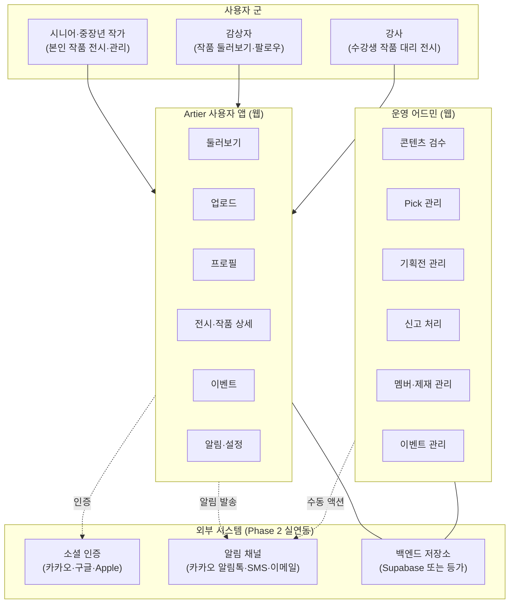
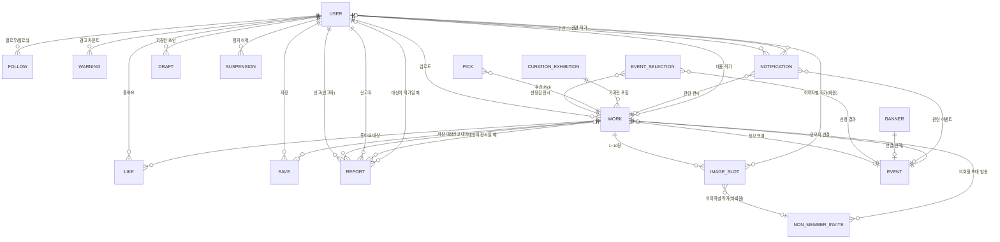
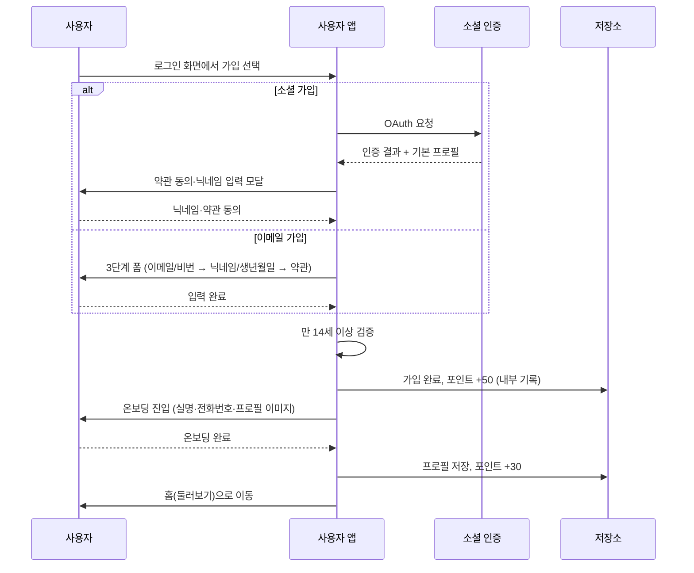
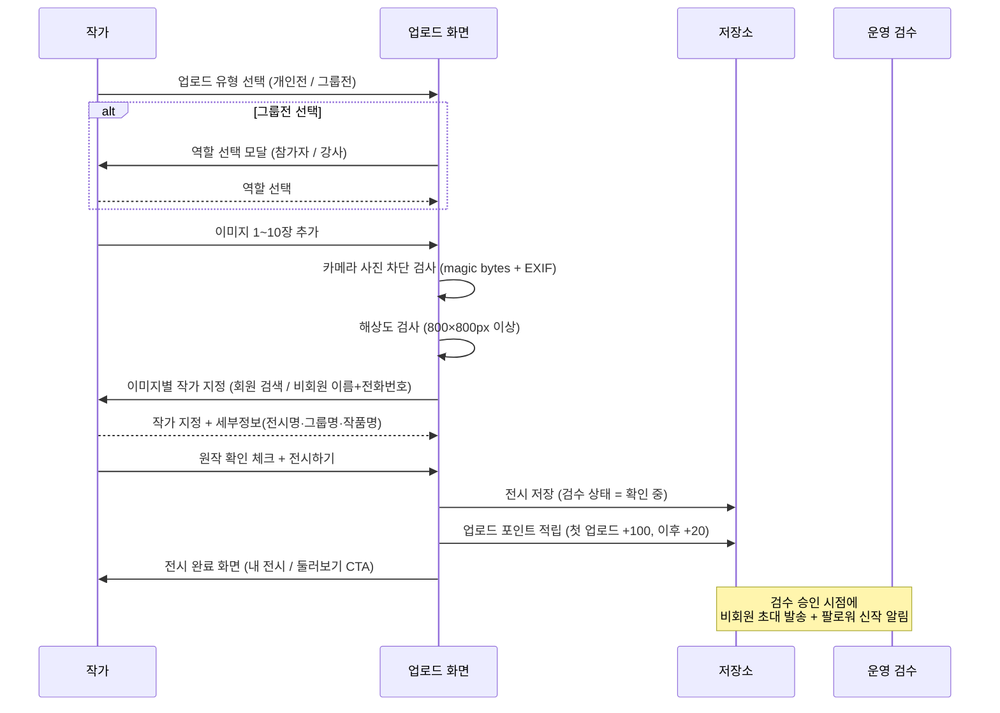
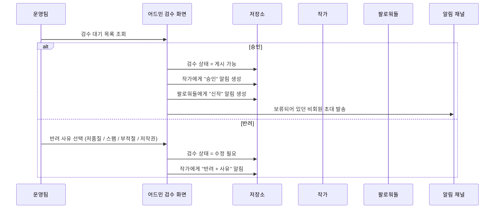
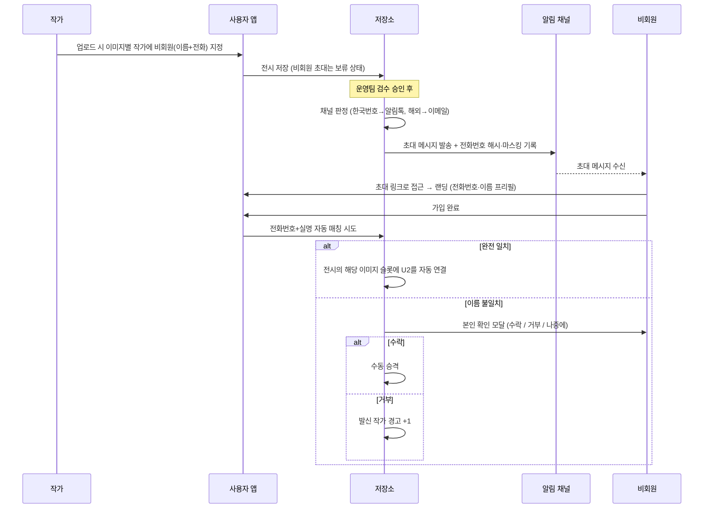

# Artier — 시스템 아키텍처 v1.0

> **v1.0 변경 요약 (2026-04-19)**:
> - 최초 작성. 사용자 앱 구현 역공학 기준 단일 스냅샷.
> - §5.2 알림 채널 참조를 Policy §1으로 정정. §10에 N-10(약관·개인정보처리방침 법무 확정본) 추가.

**작성일**: 2026-04-19
**버전**: v1.0
**근거**: 사용자 앱 구현 역공학(2026-04-19)
**상위 참조**: `README.md` (문서 규약·서비스 핵심 결정)
**본 문서의 목적**: 설계·개발 착수 시 참고할 전체 시스템 관계·데이터 모델·외부 연동을 한 장에 정리한 아키텍처 스냅샷. 이후 IA_ScreenList, Policy, PRD 문서는 이 구조를 근거로 작성된다.

---

## 0. 문서 읽는 법

이 문서는 다음 순서로 구성된다.

1. **서비스 전체 구조** — 사용자 트랙과 운영 트랙을 한 장으로 요약
2. **프론트엔드 아키텍처** — 클라이언트 측 구성
3. **데이터 모델 (ERD)** — 핵심 엔티티와 관계
4. **저장소 전략** — Phase 1 클라이언트 저장 + Phase 2 백엔드 전환
5. **외부 시스템 연동** — 인증·알림·결제 (Phase 1 모의 / Phase 2 실연동)
6. **운영 어드민 구조** — 권한 체계와 주요 액션
7. **핵심 플로우 시퀀스** — 가입·업로드·검수·초대 발송
8. **수익화·라이선스 모델** — Phase 단계별 원칙
9. **해소된 결정 사항** — 지금까지 확정된 굵직한 결정
10. **아직 열려 있는 항목** — Phase 1·2에서 결정이 남은 쟁점

다이어그램은 Mermaid로 작성되어 있으며 노션·깃허브·VS Code 프리뷰에서 그대로 렌더링된다. 엔지니어가 아닌 PM이 읽어도 이해할 수 있게 각 다이어그램 뒤에 글로 한 번 더 풀어 썼다.

---

## 1. 서비스 전체 구조

Artier는 **시니어·중장년 순수미술 작가를 위한 디지털 갤러리 플랫폼**이다. 작가가 자신의 전시를 올리고, 감상자가 작품을 둘러보고, 운영팀이 콘텐츠 품질과 커뮤니티 건강성을 관리한다.

**요약**

- **하나의 사용자 앱 + 하나의 운영 어드민** 구조. 어드민은 사용자 앱과 다른 경로(`/admin/*`)로만 접근 가능하며 일반 사용자에게 노출되지 않는다.
- 사용자 군은 세 가지로 나뉘지만 동일한 사용자 앱을 쓴다. "강사"는 별도 계정 유형이 아니라 **업로드 이력에서 자동 파생**되는 역할이다(수강생 작품을 대리 업로드한 이력이 있으면 프로필에 `수강생 작품` 탭이 자동으로 노출됨).
- Phase 1에서는 외부 시스템이 모두 모의(mock) 상태다. Phase 2 출시 범위에 실제 연동이 들어간다.

---

## 2. 프론트엔드 아키텍처

### 2.1 기술 스택

| 계층 | 선택 |
|------|------|
| 빌드 도구 | Vite |
| UI 프레임워크 | React 19 + TypeScript |
| 라우팅 | react-router v7 (선언적 라우트 트리) |
| 스타일 | Tailwind CSS + shadcn/ui · Radix UI |
| 상태 관리 | 경량 퍼블리시-서브스크라이브 스토어 (React의 `useSyncExternalStore` 기반). 외부 상태관리 라이브러리(Redux/Zustand 등)는 사용하지 않는다. |
| 국제화 | 자체 i18n 프로바이더. 현재 한국어(KO)·영어(EN) 2개 지원 |
| 이미지 처리 | 브라우저 내 `canvas`를 이용한 WebP 변환·리사이즈 |

### 2.2 렌더링 모델

- **SPA(Single-Page App)**. 서버 사이드 렌더링(SSR) 없음.
- 모든 라우트는 클라이언트 측에서 해석되며, 배포는 정적 호스팅(예: Netlify) 기준으로 한다.
- OG(Open Graph) 동적 이미지 생성은 Phase 1 범위 밖. 공유 링크의 OG는 정적 이미지로 대응한다.

### 2.3 반응형

- **모바일 우선**(375~414px 기준)으로 레이아웃을 설계하고, 데스크톱(1280px+)에서 너비 확장한다.
- 시니어 사용 맥락을 고려해 **모든 인터랙티브 요소의 최소 터치 타겟은 44×44px**.
- 가로 스크롤 영역(탭 목록 등)은 모바일에서 가능한 한 제거하고, 필요 시 그리드/줄바꿈으로 대체한다.

### 2.4 에러 경계·정지 가드

- 최상위에 **전역 에러 경계(Error Boundary)**를 두고 렌더 에러가 발생하면 폴백 UI로 대체한다.
- **계정 정지 전역 가드**: 사용자가 어떤 페이지에 있든, 정지 상태가 감지되면 즉시 강제 로그아웃하고 로그인 화면으로 유도한다.

---

## 3. 데이터 모델 (ERD)

Phase 1에서는 별도 백엔드 스키마가 없고 클라이언트가 동일한 구조로 로컬에 저장한다. Phase 2 백엔드 이관 시 이 ERD가 출발점이 된다.

### 3.1 핵심 엔티티 설명

**USER (회원)**
사용자 계정. 이메일 가입 또는 소셜 가입(카카오·구글·Apple). 실명·전화번호·생년월일은 가입 시 필수 수집한다. 프로필 편집 가능 항목: 닉네임, 한 줄 프로필(헤드라인), 바이오(200자), 국가, 관심 화풍, 외부 링크, 프로필 사진.

**WORK (전시)**
중요한 명명 규칙: 내부 타입 이름은 "Work"지만 **사용자에게 노출되는 용어는 "전시"**다. 하나의 업로드 = 하나의 전시이며, 1~10장의 이미지를 포함하는 컨테이너로 작동한다.

- 전시 유형: 개인전(`solo`) / 그룹전(`group`)
- 그룹전의 경우 **참가자 역할**(본인 작품 최소 1점 포함) 또는 **강사 역할**(수강생 작품 대리 업로드, 본인 작품 포함 금지) 선택
- 검수 상태: 확인 중 / 게시 가능 / 수정 필요 — 기본값 "확인 중"
- 배지: Pick 배지(주간 선정 이력), 이벤트 선정작 배지(향후 추가)

**IMAGE_SLOT (전시 내 개별 이미지)**
별도 엔티티로 저장하지 않고 WORK 안의 배열 요소로 존재한다. 각 슬롯은 이미지 URL, 작품명, 이미지별 작가 지정 정보를 가진다.

- 이미지별 작가 지정은 **회원**(ID 연결) 또는 **비회원**(이름 + 전화번호)으로 선택
- 개별 작품명은 전시 단위로 저장되지만, 이미지 슬롯별로 각기 다르게 지정 가능
- 좋아요·저장·픽·신고·배지는 이 레벨에 **없다** (모두 WORK 단위)

**EVENT (이벤트)**
운영팀이 주관하는 공모전·특집전 등. Phase 1에서는 응모(`linkedEventId`로 전시가 연결됨)만 동작하고, **선정 시스템은 Phase 1 후순위 TODO**로 유보되어 있다.

**PICK·CURATION_EXHIBITION (운영팀 큐레이션)**
Pick은 주간 최대 10개 전시 선정(교체 가능), 기획전은 운영팀이 여러 전시를 주제로 엮어 내보내는 공개 컬렉션. 둘은 완전히 별개 시스템이며 자세한 정책은 Policy 문서 §5 참조.

**NON_MEMBER_INVITE (비회원 초대)**
업로드 시 이미지별 작가를 "비회원"으로 지정할 수 있다. 전시가 운영팀 검수 승인 시점에 해당 비회원에게 카카오 알림톡(한국)·이메일(해외)로 초대 메시지가 발송되고, 이후 가입 시 전화번호+실명 일치로 자동 매칭된다.

**REPORT (신고) / WARNING (경고)**
사용자는 부적절한 전시·작가를 신고할 수 있다. 운영팀 처리 액션에 따라 경고 카운트 또는 허위 신고 카운트가 누적되며, 각각 3회 누적 시 자동 7일 정지가 발동된다.

**NOTIFICATION (알림)**
좋아요·팔로우·검수 결과·신작 발행 등 이벤트성 알림. 수신자별로 누적되며 읽음/삭제 가능. 보관 정책은 90일 최대 200개.

**DRAFT (초안)**
업로드 화면에서 "초안 저장" 버튼으로 명시적으로 저장한 작업 중 데이터. 자동 저장은 없다. 사용자가 이어서 작업하거나 삭제 가능.

**SUSPENSION (정지)**
주의 / 7일 정지 / 30일 정지 / 영구 정지 4단계. 자동 승격(경고 3회·허위 신고 3회)과 운영팀 수동 조치 모두 지원.

---

## 4. 저장소 전략

### 4.1 Phase 1 — 클라이언트 로컬 저장

Phase 1은 별도 백엔드 없이 브라우저에서만 동작한다.

| 계층 | 용도 |
|------|------|
| **localStorage** | 기본 앱 상태(작품 목록·프로필·인터랙션·알림·배너·이벤트·큐레이션·신고·제재 카운터·가입 레지스트리 등) |
| **IndexedDB** | 용량이 큰 이미지 데이터 URL이 localStorage 쿼터를 초과할 경우 자동 오프로드. 작품 삭제 시 연쇄 삭제. |
| **sessionStorage** | 스크롤 위치 복원, 세션 한정 임시 플래그(예: 이름 불일치로 보류된 초대 목록) |

### 4.2 버전 관리

- 작품 저장소에 **스토리지 버전 키**가 있고, 버전이 달라지면 시드 데이터만 재시드하고 사용자 업로드는 보존한다. 필드명 변경 등 스키마 마이그레이션도 이 시점에 수행한다.
- 예: 기존 필드 이름 `editorsPick` → `pickBadge`로 바꿀 때, 사용자 저장분의 기존 값을 새 필드로 옮기는 마이그레이션이 동반됨.

### 4.3 Phase 2 — 백엔드 전환 계획

- **대상**: Supabase(또는 등가의 관리형 Postgres + Auth + Storage) 기준으로 설계
- **이관 방식**: 위 ERD를 Postgres 스키마로 정제 → 클라이언트 저장 구조를 어댑터 레이어로 감싸서 API 호출로 전환
- **이미지 저장**: 브라우저의 IndexedDB 이미지는 서버 Storage로 이관(마이그레이션 스크립트)
- **배포 영향**: 사용자 경험은 동일하게 유지. URL 체계·화면은 변경 없음을 원칙으로 한다.

---

## 5. 외부 시스템 연동

### 5.1 인증

| 항목 | Phase 1 | Phase 2 |
|------|---------|--------|
| 이메일 로그인·가입 | 모의 (로컬 검증) | 실제 JWT 기반 |
| 카카오 소셜 | 모의 (UI만) | Kakao OAuth 실연동 |
| 구글 소셜 | 모의 | Google OAuth 실연동 |
| Apple 소셜 | 모의 | Sign in with Apple |
| 본인 인증 (실명·전화번호) | 가입 폼에서 자체 수집 | 본인 인증 API(PASS 등) 연동 검토 |

### 5.2 알림 채널 라우팅

사용자의 **전화번호 국가 코드를 기준으로 알림 채널이 라우팅**된다. 자세한 정책은 Policy §1 참조.

| 사용자 | 일반 알림 (좋아요·팔로우·초대·검수) | 비밀번호 재설정 | 법적 고지 (약관 변경·개인정보) |
|--------|------------------|------------------|------------------|
| 한국 사용자 | 카카오 알림톡 → SMS 폴백 | 카카오 알림톡 → SMS 폴백 | 이메일 (법적 기록 보존용) |
| 해외 사용자 | 이메일 | 이메일 | 이메일 |

Phase 1에서는 모든 발송이 모의(로그 저장만)이며, Phase 2에서 실제 발송 서비스(카카오 알림톡 API + SMS 게이트웨이 + 트랜잭션 메일)와 연동한다.

### 5.3 분석(Analytics)

Phase 1은 이벤트 호출 지점만 스캐폴딩되어 있고(GA4 `gtag()` 형태), 실제 송신은 연결되지 않았다. Phase 2에 운영팀이 데이터 기준을 확정한 뒤 실제 송신을 켠다.

### 5.4 결제 (Phase 2 이후)

Phase 1은 무료 서비스. Phase 2 이후 유료 기능 도입 시 결제 PG 연동을 별도로 논의한다.

---

## 6. 운영 어드민 구조

### 6.1 접근 제어

- URL 경로 `/admin/*`로 진입
- 접근 조건: 로그인 + **운영자 권한 플래그** (Phase 1은 로컬 세션 토글, Phase 2에서 서버사이드 권한으로 승격 필수)

### 6.2 권한 계층 (Phase 2 설계)

Phase 1은 단일 운영자 레벨로 단순 운영된다. Phase 2 확장 시 아래 3단계를 권장한다.

| 권한 | 가능 액션 |
|------|---------|
| 최고 운영자 | 전 기능(멤버 정지·삭제·권한 부여 포함) |
| 에디터 | 콘텐츠 관리(검수·Pick·기획전·배너·이벤트·신고 처리). 멤버 삭제·권한 부여 불가 |
| 뷰어 | 모든 데이터 조회만 가능. 수정·삭제 불가 |

### 6.3 주요 어드민 화면 (IA_ScreenList 참조)

- 대시보드 (ADM-DSH)
- 콘텐츠 검수 (ADM-REV)
- Pick 관리 (ADM-PCK)
- 기획전 관리 (ADM-CUR)
- 배너 관리 (ADM-BNR)
- 이벤트 관리 (ADM-EVT)
- 신고 처리 (ADM-RPT)
- 멤버 관리 (ADM-MBR)
- 작품 관리 (ADM-WRK)
- 파트너 작가 (ADM-PTN)
- 런칭 체크리스트 (ADM-CKL)
- 미결 이슈 (ADM-ISU)

---

## 7. 핵심 플로우 시퀀스

### 7.1 신규 가입 (소셜 또는 이메일)

**요약**: 소셜과 이메일 진입로가 다르지만 이후 온보딩(실명·전화번호·프로필 이미지)은 공통. 만 14세 미만은 가입 차단.

### 7.2 전시 업로드 (개인전 / 그룹전 — 참가자 또는 강사)

**요약**: 업로드는 역할 결정 → 이미지 → 작가 지정 → 세부정보 → 발행의 5단계. 카메라 촬영 사진은 파일 내용 기반으로 차단된다(확장자 변경으로 우회 불가). 비회원 초대는 업로드 시점이 아니라 **검수 승인 시점**에 발송된다.

### 7.3 콘텐츠 검수

**요약**: 운영팀의 승인·반려 액션이 알림·비회원 초대 발송의 트리거가 된다. 반려 사유는 4종 중 1개를 필수로 선택해야 한다.

### 7.4 비회원 초대 → 자동 매칭

**요약**: 비회원 초대는 검수 승인 시점에만 발송되고, 가입 시 전화번호+실명으로 자동 매칭된다. 이름이 다르면 본인 확인 모달에서 최종 판단. 거부 시 발신한 작가에게 경고 1회 누적.

---

## 8. 수익화·라이선스 모델

- **Phase 1**: 전면 무료. 사용자 가입·전시 업로드·감상·이벤트 참여에 어떤 결제도 요구하지 않는다.
- **Phase 2 이후**: 수익 모델 별도 논의. 유료 구독·프리미엄 전시·마켓 기능 등은 현 시점 미정.
- 포인트(AP) 시스템은 Phase 1에서는 내부 적립만 동작하고 사용자에게 노출되지 않는다. Phase 2 이후 연동 방향 별도 결정.

---

## 9. 해소된 결정 사항

설계·기획 과정에서 확정된 굵직한 결정을 모은다. 변경이 필요하면 버전을 올려 해당 섹션을 수정한다.

### 9-1. 좋아요·저장·픽·신고·배지는 모두 "전시(WORK 컨테이너) 단위"
개별 이미지 단위 인터랙션은 없다. 이미지 단위로 존재하는 것은 작품명·이미지별 작가 지정뿐.

### 9-2. 강사 여부는 자동 파생
업로드 이력에 강사 역할 전시가 한 건이라도 있으면 프로필에 "수강생 작품" 탭이 자동 노출된다. 프로필에 수동 토글은 없다.

### 9-3. 비회원 초대는 검수 승인 시점에 발송
업로드 순간에는 전화번호만 전시에 보관하고, 운영팀 승인 이후 실제 발송된다. 반려 시 보류 초대는 폐기.

### 9-4. 카메라 촬영 사진은 업로드 차단
파일 내용(magic bytes로 JPEG 판별 후 EXIF Make/Model 확인)으로 판별하므로 확장자 변경으로 우회할 수 없다.

### 9-5. 탈퇴 작가 처리
작품·전시는 유지되고 작가명이 "작가 미상"으로 익명화된다. 해당 작가에 대한 좋아요·저장·팔로우·신고 인터랙션은 모두 차단된다. 프로필 페이지 자체 접근도 불가.

### 9-6. 자동 저장 없음, 수동 초안 저장만
업로드 화면에서 작업 중 자동 저장은 제공하지 않는다. 사용자가 "초안 저장" 버튼을 눌러야 저장된다.

### 9-7. Pick과 기획전은 서로 다른 시스템
Pick은 주간 10개 개별 전시 선정(영구 배지), 기획전은 운영팀이 여러 전시를 주제로 엮는 공개 컬렉션(배지 없음). 배너에 별도 라벨(NEW/HOT/EVENT 등)은 두지 않는다.

### 9-8. 이벤트 선정작 배지 원칙
이벤트·주간 공모 테마전의 선정작에는 영구 배지를 부여한다. 응모작(`linkedEventId` 연결된 상태)에는 배지 없음. 구현은 Phase 1 후순위 TODO.

### 9-9. 본인이 전시를 비공개로 전환하는 기능은 없음
전시 비공개(`isHidden`)는 어드민이 신고 처리 또는 부적절 콘텐츠 관리 용도로만 조작한다.

### 9-10. 자동 정지 승격은 전체 사용자 대상
신고 경고 3회 누적 시 대상 작가 7일 정지, 허위 신고 3회 누적 시 신고자 7일 차단. 시범 계정이 아닌 전체 사용자에게 동일하게 발동된다.

### 9-11. 로컬 날짜 기준
배너 노출 기간·이벤트 상태 판정·작품 업로드일 기록은 모두 사용자 로컬 시간대의 YYYY-MM-DD를 기준으로 한다(UTC 기준 비교는 한국 사용자에게 9시간 밀림 문제 발생).

---

## 10. 아직 열려 있는 항목

Phase 1 런칭 또는 Phase 2에서 결정이 필요한 쟁점.

### N-1. 이벤트 선정 시스템 구현 (Phase 1 후순위)
원칙은 §9-8에서 확정. 어드민 이벤트 상세에 "선정 작품 관리" 섹션 추가, 주간 공모 테마전도 이벤트의 한 종류로 통합, 선정 시점에 영구 배지 부여 로직 등 상세 구현이 남아 있다.

### N-2. 운영자 내부 컬렉션 (Phase 2)
운영팀이 "좋은 전시·작가·그룹"을 내부 북마크하는 비공개 툴. 발굴·추적 목적. 현 Phase 1에선 수동 관리(엑셀·노션 등 외부 도구)로 대체.

### N-3. 작품 카테고리 분류 (Phase 2)
`art / fashion / craft / product` 등 카테고리 축으로 작품을 분류하는 기능. Phase 1엔 UI·정책 없음. Phase 2에 도입 시 업로드 플로우·검색·필터에 반영 필요.

### N-4. 소셜 가입 시 만 14세 연령 검증
이메일 가입은 생년월일 입력·검증이 있으나 소셜 가입은 OAuth 결과만 신뢰하는 구조라 연령 검증이 빈틈. 본인 인증 API 연동 또는 소셜 가입 후 생년월일 추가 수집이 필요.

### N-5. 이벤트 알림 구독 해지 수단
Phase 1 현재는 이메일 구독 추가만 가능하고 해지 UI가 없다. 개인정보보호법·GDPR 관점에서 **런칭 전 반드시 해결 필요**.

### N-6. 스토리지 마이그레이션 전략
스토리지 버전 변경 시 시드 재시드는 구현되어 있으나, 사용자 데이터를 어떤 기준으로 변환할지 체계가 아직 단순. Phase 2 백엔드 이관 시 일회성 마이그레이션 스크립트가 필요하다.

### N-7. 어드민 권한 계층 분리
Phase 1은 단일 운영자 레벨. Phase 2에서 §6.2의 3단계(최고 운영자 / 에디터 / 뷰어)로 확장할 때 기존 운영 데이터의 권한 매핑·감사 로그 체계를 함께 설계해야 한다.

### N-8. 커뮤니티 기능 확장 (Phase 2 이후)
팔로우 기반 약한 연결이 이미 있고, 향후 댓글·메시지·그룹 기능 확장이 예상된다. 용어 체계(팔로우 유지 결정)는 이 확장성을 고려한 선택이며, 구체 범위는 Phase 2 기획에서 다룬다.

### N-9. OG 이미지 동적 생성
공유 링크가 외부(SNS·메신저)에서 미리보기로 노출될 때 작품 썸네일과 전시명을 담은 OG 이미지가 필요. SPA 구조 제약으로 서버 측 렌더링이 필요하며 Phase 1에는 정적 대체 이미지로 대응.

### N-10. 약관·개인정보처리방침 법무 확정본 (런칭 전 필수)
이용약관·개인정보처리방침 현재 초안 상태. 런칭 전 법무 검토 후 확정 필요. 개인정보보호법 대응을 위해 데이터 내보내기·삭제 요청 기능도 함께 구비해야 한다. DPO(개인정보보호 책임자) 지정·공개도 법적 요건.

---

## 문서 이력

| 버전 | 일자 | 작성 | 변경 내용 |
|------|------|------|----------|
| v1.0 | 2026-04-19 | PM × Claude | 최초 작성. 사용자 앱 구현 역공학 기준 단일 스냅샷. 정합성 보정: §5.2 "Policy §6" → "Policy §1"(알림 채널). §10에 N-10 추가. |
